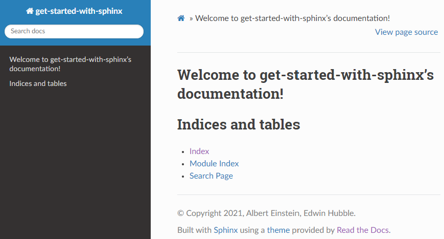
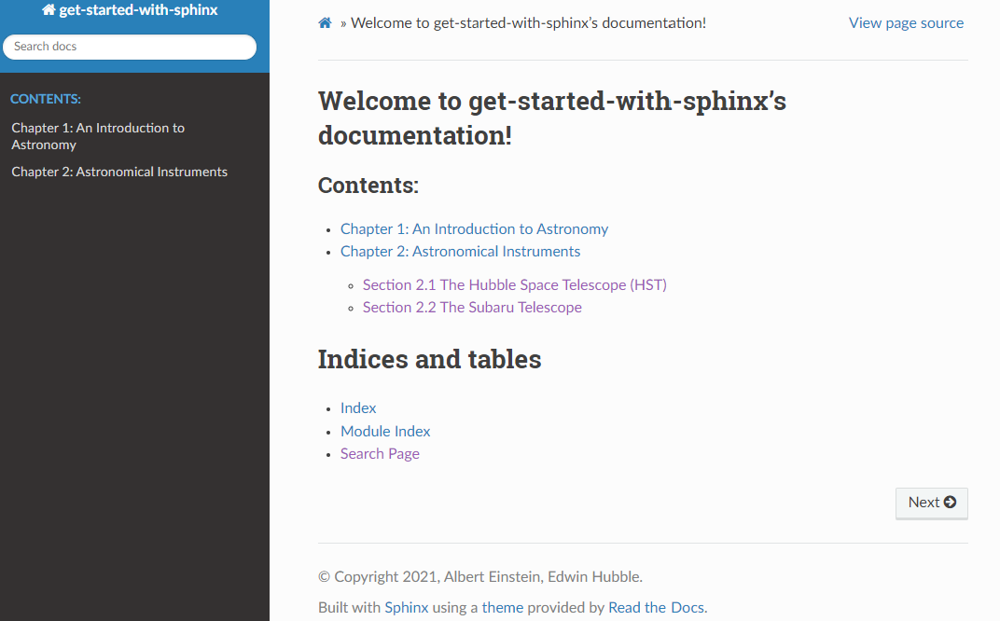

*******************************
Document Your Project
*******************************

.. include:: /global.rst

What is a Documentation ?
============================

A documentation is the major part of a published project that tells users 
about the functionality provided by your project. In scientific community, 
the importance of documentation is 
usually underestimated,
partly because the hurry of science people and the lack of target users. 
But this is not the reason for skipping this vital part - a clear documentation 
is the first step to increase the popularity of your project.

.. _project-man-doc-parts:

A documentation usually consists of the following parts.

- A **brief introduction** to the project. Its name, logo, motivation, target users, main features, advantages over 
  other competitors. As a reliable developer, it is also necessary to hint the drawbacks/caveats of your project.
- A **quick start guide**, including how to download the resources, install the software, setup the run-time environment,
  how to quickly begin a "hello world" example, and where to go for the next step.
- A **tutorial** which introduce the main components of your project. Step by step guides should be provided to users.
- A **detailed reference**. List every detail of the project that you want to provide to the users. For a library, list 
  every (sub-)modules, classes, function and variables, and carefully describe them.
- Other project-related information. The license, the list of contributors, how to seek for help, how to raise issues.

Many good examples of documentations are written by various developers. We explore some of them in the following.

**Nlohmann JSON**

.. margin::
    
    .. tip::

        JavaScript Object Notation (`JSON <https://www.json.org/json-en.html>`_) is de facto standard data 
        representation format in Web development due to the popularity of JavaScript programming language.
        It represents dictionaries, arrays, strings and number by serialized string. It is human readable
        and therefore machine-independent.


`Nlohmann JSON <https://github.com/nlohmann/json>`_ is a modern C++ library for 
parsing/dumping JSON data streams. It is particularly
useful for loading configure files at the entrance of a program. We will give a more 
complete introduction to the JSON libraries
in the :doc:`Python Programming <../python-programming/index>` and :doc:`C++ programming <../cpp-programming/index>`
chapters. We will also introduce the JavaScript programming in the :doc:`GUI Development <../gui-development/index>` 
chapter.
But let us focus on its documentation organization in this section.

Nlohmann JSON library is hosted on Github, and provides its documentation in a single **Markdown** page, suitable
for such a single-usage library. The main components of the documentation are:

- The **design goals**, i.e., the brief introduction.
- The **integration**, i.e., how to install the library.
- The **examples**, i.e., quick start and tutorials.
- The **full API** details are provided in another website.
- Other related information.


Therefore, it is fully compliant to the :ref:`required parts <project-man-doc-parts>` we have introduced.


**NumPy**

`NumPy <https://numpy.org/doc/stable/>`_ is the fundamental package for scientific computation in Python.
It provides basic array/matrix operations, linear algebras, statistical operations and random number generators, etc.
NumPy will be introduced in the :doc:`Python Programming/Scientific Computation <../python-programming/index>` 
section, here we focus on its documentation organization.

NumPy is a large library, so its documentation should be hosted on a `separate website <https://numpy.org/doc/stable>`_.
It has several versions, from old, stable to those for developers. Each of those version has a separate entrance 
of documentation, but they all share the same structure:

- **Why is NumPy** states the its design goal and target users.
- **Absolute beginner's guide** tells the installation and the most simple usage. Install and Quick start are 
  organized in distinct part because its wide target.
- **Tutorials** and **How tos** and **fundamentals** introduce its main components.
- The **API reference** is so long, so it is provided through a separate page. NumPy is written in C so its full 
  C-API is also provided.

Despite of complex of NumPy, its documentation still follows the common structures with 
all :ref:`required parts <project-man-doc-parts>`.


**The IllustrisTNG Project**

`IllustrisTNG <https://www.tng-project.org/>`_ ...

Overview of of Documentation-Writting Tools
=============================================

Documentation can be written by any human-readable text format. The most common formats are

- **Txt**: plain text format, usually with file name suffix :rawtext:`.txt`. It is supported on almost any 
  operating system and almost any text editor. Some raw catalogs in astronomy provide 
  documentation with txt format, mainly due to the historical reason, simplicity 
  requirement and stability requirement.
  Examples include the `galaxy group catalogs <https://gax.sjtu.edu.cn/data/Group.html>`_ of Yang X.-H. et al.
- **Markdown**: a simple, linear-layout markup language, usually with suffix :rawtext:`.md`. 
  Markdown is designed as a simplified version of **HTML**
  language - only the most important features, like heading, paragraph, hyperlink, image, list, table, etc., are 
  preserved. `Github <https://github.com/>`_ uses it as the default (and only available) documentation format.
- **ReStructuredText (ReST)** and **Sphinx**: a full featured documentation format, 
  usually with suffix :rawtext:`.rest` or :rawtext:`.rst`,
  particularly suitable for writting
  documentation for codes. It is a superset of **Markdown**, and a subset of **HTML**. 
  This project, `AstroHammmer <https://project-astro-hammer.readthedocs.io/>`_,
  is written in **ReST** and organized by **Sphinx**.
- **HyperText Markup Language (HTML)**: a full featured language, capable for any documentation. 
  A HTML file is usually suffixed with :rawtext:`.html`.
  It is a dragon-killing 
  technique, very complicated, but able to control every aspect (every character or even every pixel) of 
  your documentation. Every modern website uses **HTML** pages to describe its structure.
- Word and LaTeX: forget them - they are not the correct documentation formats.

Plain text is so simple that we cannot tell much about it in AstroHammmer. **HTML** is overcomplicated so that 
half of a individual chapter, :doc:`GUI Development <../gui-development/index>`, is provided to introduce it.
In the following of this section, we introduce how to use **Markdown** and **ReST**/**Sphinx**.

Some programming languages provide library tools to generate documentations from inline comments of source files.
This indeed helps to generate the API reference, but helps little for other parts of a full documentation, i.e., 
the basic techniques in this section are still mandatory for documentation.
We will explore the language-specific documentation tools in the corresponding chapters.


Using Markdown
================

Editing and Building
----------------------

Markdown is a simple markup language for linearly layout documentations. It can be 
written in any text editor. There are many ways to render it as an styled output.

- Online editors: For example, `Dillinger <https://dillinger.io/>`_ allows editing Markdown file
  and see the preview immediately. It also allows generating HTML of PDF output so that you can 
  preview the documentation in Browser or PDF reader.
- Code hubs: Simply create a `Github <https://github.com/>`_
  repository, create Mardown files in it, and edit them online.
- Local editors: For example, VSCode users may install git extension "Markdown All in One", and
  press "Ctrl+Shift+V" to preview.
- Parsers in Programming Languages: For example, in Python, use `Python-Markdown <https://github.com/Python-Markdown/markdown/>`_,
  you make read all content from a Markdown file, convert it to a HTML string and save it. You 
  may then preview the output by Browser.
  In JavaScript, use `showdownjs <https://github.com/showdownjs/showdown>`_ to parse a Markdown
  string to a HTML string and render it in the DOM tree.

Note that different building systems may provide different extensions to the minimal set of 
basic Markdown language. For example, math formula cannot be rendered on Github but can be 
rendered in some of the other online editors. Be cautious to the actual standard of the target site 
that hosts your documentation.

Syntax
-------

Markdown has very simple syntax. This includes block markups like headings, paragraphs, lists,
code blocks and tablies,
and inline markups like emphasis, hyperlinks, images, and inline codes. 
Below we list the standard part of 
Markdown syntax. The extension part can be found in the Further Readings section.

Headings
""""""""""

.. code-block:: md

  # This is level-1 Heading
  ## This is level-2 Heading
  ...
  ###### Up to level-6 Heading

Rendered output depends on the rendering system:

.. raw:: html

  <p style="font-size: 2.0em;">This is level-1 Heading</p>
  <p style="font-size: 1.75em;">This is level-2 Heading</p>
  <p>...</p>
  <p style="font-size: 1.15em;">Up to level-6 Heading</p>

Paragraphs
"""""""""""""

.. code-block:: md

  Simply type sentences for a paragraph. A paragraph may span
  multiple lines.

  Use a blank line to separate two paragraphs.

Rendered output:

Simply type sentences for a paragraph. A paragraph may span
multiple lines.

Use a blank line to separate two Paragraphs.

Emphasis
""""""""""

.. code-block:: md

  This text will be *Italic*. This text will also be _Italic_.

  This text will be **Bold**. This text will also be __Bold__.

Rendered output:

This text will be *Italic*. This text will also be *Italic*.

This text will be **Bold**. This text will also be **Bold**.


Lists
"""""""""""

Lists can be created with a asterisks :rawtext:`*`, dashes :rawtext:`-` or 
plus signs :rawtext:`+` in front of lines, and can be nested with indentations.

.. code-block:: md

  * Item 1a
  * Item 1b
    - Nested Item 2a
    - Nested Item 2b
      + Deeper Nested Item 3a
      + Deeper Nested Item 3c

Rendered output:

* Item 1a
* Item 1b
  
  * Nested Item 2a
  * Nested Item 2b
    
    * Deeper Nested Item 3a
    * Deeper Nested Item 3c

Oreder lists can be created with numbers followed periods, and can be nested.
The numbers do not have to be in any numerical order.

.. code-block:: md

  1. Item 1
  2. Item 2
  3. Item 3
     1. Nested Item 1
     2. Nested Item 2
     3. Nested Item 3

Rendered output:

1. Item 1
  
2. Item 2
  
3. Item 3

  1. Nested Item 1
   
  2. Nested Item 2
   
  3. Nested Item 3

Hyperlinks
"""""""""""

Texts with hyperlinks can be create by a special grammer :rawtext:`[content text](url)`.
The :rawtext:`content text` is the text that readers see, and url is either a absolute
url or a absolute or relative path in the file system (if hosted on Github).

.. code-block:: md

  Your [GitHub](http://github.com/) repositories.

Rendered output:

Your `Github <http://github.com/>`_ repositories.

Images
"""""""""

Images can be denoted by :rawtext:``.
The :rawtext:`alt text` usually cannot be seen - it is displayed only if 
the image cannot be rendered for some reason.

.. code-block:: md

  

Rendered output:


Codes
""""""""""

Code samples can be either inline or block. For block code, you may specify a 
language for highlighting (e.g., python, cpp, text).

.. code-block:: md

  This is an inline code sample: `d = {'a': 1, 'b': 2}`, and this is a code block:
  ```python
  def add(a, b):
      return a+b
  ```

Rendered output:

This is an inline code sample: ``d = {'a': 1, 'b': 2}``, and this is a code block::

  def add(a, b):
    return a+b

Tables
"""""""""""""

Tables are created by list of words, with hyphens, :rawtext:`-`, and pipes, :rawtext:`|` 
separating rows and columns. Alignment can be specified by colons at left, right or both sides of 
the hyphens below the header row.

.. code-block:: md

  Planet | Star | Galaxy 
  ---:|:---:|---
  Earth| Sun | Milky Way - the Galaxy
  Jupyter | Alpha Centauri | M31 - Andromeda

Rendere output:

.. table::
  :class: project-man-doc-markdown-table-output tight-table

  =================== =================== ========================
  Planet              Star                Galaxy 
  =================== =================== ========================
  Earth               Sun                 Milky Way - the Galaxy
  Jupyter             Alpha Centauri      M31 - Andromeda
  =================== =================== ========================


Further Readings
------------------

Many resources about Markdown writting can be found online. We list some of them.

- The github guides `Mastring Markdown <https://guides.github.com/features/mastering-markdown/>`_.
- `Markdown cheat sheet <https://www.markdownguide.org/cheat-sheet/>`_ - a quick reference to the Markdown syntax.

.. _project-man-doc-sphinx:

Using Sphinx
===============


Sphinx is a documentation generation system written in Python. It was originally 
developed for Python documentation, but later extended to document anything.

Sphinx does not specify anything about the document format - it is a framework 
to organize and generate docs. It parse the source files written in other 
markup languages (Markdown, ReST, etc.),
collect them into a single documentation tree, and generate the readable documentations
in various formats (HTML, PDF, etc.). Users can view the documentations 
by Internet browsers or PDF readers. There are also websites that can host
the documentation for you.

The most widely used markup language for Sphinx documentation is ReStructuredText (ReST)
language, which is an extension of Markdown and a subset of HTML. It include many 
useful features to organize multiple documentation files, specify targets and cross-ref 
them, and style the codes.

.. _project-man-doc-sphinx-start:

Start Your Sphinx Documentation
-------------------------------

Installation
"""""""""""""


.. margin::

  .. note::

    To isolate the side effects of the installations and buildings in this section on your 
    machine, it is better 
    to create a new virtual environment (e.g., by conda, as will introduced in the chapter 
    :doc:`Development Environment <../development-environment/index>`).

First, with a Python environment, install Sphinx by running:

.. code-block:: bash 

  $ pip install sphinx 

If you use conda to manage
the python environment, it is better to install sphinx with conda: 

.. code-block:: bash

  $ conda install sphinx

Refer to the `Sphinx Doc/Install Sphinx <https://www.sphinx-doc.org/en/master/usage/installation.html>`_ for other ways
of installation.

Choose a Theme
"""""""""""""""""

Many projects have used Sphinx to generate documentations. They developed 
sphinx themes with different styles. See the `theme gallery <https://sphinx-themes.org/>`_ for a review.

In this introduction we use :rawtext:`sphinx-rtd-theme`. It is the official 
theme designed by `Read the Docs <https://readthedocs.org/>`_, widely used 
in many projects. Install it by running:

.. code-block:: bash

  $ pip install sphinx-rtd-theme

For a detailed description about how to configure the theme, see 
`Read the Docs Sphinx Theme <https://sphinx-rtd-theme.readthedocs.io/en/latest/>`_.

Start Your Doc
""""""""""""""""""""""""

Choose a path in your operating system, make a new directory, enter it, and running :bash:`sphinx-quickstart` to
initialize a new documentation system. For example:

.. code-block:: bash

  $ mkdir get-started-with-sphinx && cd get-started-with-sphinx
  $ sphinx-quickstart

Some question will be asked. For "Separate source and build directories", answer "n"; for project 
name, type your project name, like "get-started-with-sphinx"; for "author names", type a name or a list 
of names, like "Albert Einstein, Edwin Hubble"; for "project release", type your version number, like
"0.0.1.alpha"; for "project language", choose "en".

After this, a near-empty documentation system is initialized, with the current directory as the root 
directory (i.e., all absolute paths in doc files start from here). Some files and folders are created:

.. code-block:: text

  get-started-with-sphinx
    |- _build/        # rendered output files are written here
    |- _static/       # static content, like style sheet files and scripts
    |- _templates/    # template HTML files
    |- conf.py        # documentation configurations
    |- index.rst      # the home page of the doc, i.e., root of the doc tree
    |- make.bat       # shell script for rendering
    |- Makefile       # shell script for rendering

We will see the usages of these files/folders later.

Configure and Build
"""""""""""""""""""""""""""""""

The configuration file :rawtext:`conf.py` specifies how sphinx renders your 
documentation. In this tutorial, we add this import line at its beginning::
  
  # conf.py
  import sphinx_rtd_theme

to import the theme we have chosen. We change the :rawtext:`extensions = [...]`
and :rawtext:`html_theme` settings as::

  # conf.py
  extensions = [ "sphinx_rtd_theme" ]
  html_theme = "sphinx_rtd_theme"
  html_theme_options = {
      "navigation_depth": -1
  }

to enable the extension, set the theme, and control the theme options for navigator style.

To build the documentation as HTML format for the readers, run:

.. code-block:: bash 

  $ make html



Now, the output files are put into :rawtext:`_build/html` folder. 
Open the file :rawtext:`index.html` with your Internet browser to see the rendered 
documentation, as shown in the Figure.

Because currently we only have one doc file :rawtext:`index.rst` in the documentation root,
the rendered output has only one page, with some index pages automatically generated 
by Sphinx. We will introduce how to organize and write documentation files in the remaining 
of this section. Each time you change any file, run :rawtext:`$ make html` again to 
override the output.

After changing a theme or adding customized style sheet, you may have to clean 
the cache of building by running :rawtext:`$ make clean` and clear the cache of browser 
to see the new effect.

Basic Syntax
--------------

A ReST document usually suffixed with :rawtext:`.rst`. Let us start with the 
root document :rawtext:`index.rst`.

We begin with the Markdown-like syntax which describes block elements like headings, 
paragraphs, lists, code blocks and tables, and inline elements like
emphasis, hyperlinks, images, inline codes. We then move to deeper topics 
about ReST. 

Sphinx itself has a well organized tutorial for ReST - 
the `reStructuredText Primer <https://www.sphinx-doc.org/en/master/usage/restructuredtext/index.html>`_.

Headings, Paragraphs and Emphasis
"""""""""""""""""""""""""""""""""""""

Headings are created by underlining (and optionally, overlining) the heading 
texts with punctuation character, at least as long as the text:

.. code-block:: rst

  ===================
  The heading
  ===================

  Also a Heading
  ++++++++++++++++++

  Lower-level Heading
  ----------------------

Allowed characters include :rawtext:`#`, :rawtext:`*`, :rawtext:`=`, :rawtext:`-`, :rawtext:`^`, 
and :rawtext:`"`. No specific meanings are assigned to each of these character. The levels
of headings are determined by the order they appear.

The extra effects of headings depend on the theme. Some themes put items in the 
main navigator for headings, while some put in the side navigator, and some allow
controlling the nested depth that can be displayed. Refer to the manuals of the 
themes for details.

Rendered output:

.. raw:: html

  <p style="font-size: 2.0em;">The Heading</p>
  <p style="font-size: 1.75em;">Also a Heading</p>
  <p style="font-size: 1.15em;">Lower-level Heading</p>

As in Markdown, paragraphs are barely sentences. Two paragraphs are separated by 
at least one blank line. Use two asterisks :rawtext:`**` to mark bold emphasis 
and use one for italic:

.. code-block:: rst

  Simply type sentences for a paragraph. **A paragraph** may span
  multiple lines.

  Use a blank line to separate *two paragraphs*.

Rendered output:

Simply type sentences for a paragraph. **A paragraph** may span
multiple lines.

Use a blank line to separate *two paragraphs*.

Lists
"""""""""""

Unordered lists are created by putting an asterisks :rawtext:`*` in front of 
each of the list items. Nested lites are made by proper indentation with any 
number of spaces, but a blank line is necessary to separate them:

.. code-block:: rst

  * Item 1a
  * Item 1b
    
    * Nested Item 2a
    * Nested Item 2b
      
      * Deeper Nested Item 3a
      * Deeper Nested Item 3c
  
Rendered output:

* Item 1a
* Item 1b
  
  * Nested Item 2a
  * Nested Item 2b
    
    * Deeper Nested Item 3a
    * Deeper Nested Item 3c

Ordered lists are created by prefixing each item with a number and a dot, or a :rawtext:`#` and a dot:

.. code-block:: rst

  1. Item 1
  2. Item 2
  3. Item 3

    1. Nested Item 1
    2. Nested Item 2
    3. Nested Item 3

Rendered output:

1. Item 1
2. Item 2
3. Item 3

  1. Nested Item 1
  2. Nested Item 2
  3. Nested Item 3


Hyperlinks
"""""""""""

.. |inlinehyperlink| raw:: html 

  `content text &#60;url&#62;`_

ReST provide different types of hyperlinks for specific tasks. An Internet URL can
be referred to by |inlinehyperlink|, with at least one space before "<". 

.. code-block:: rst

  Your `GitHub <http://github.com/>`_ repositories.

Rendered output:

Your `GitHub <http://github.com/>`_ repositories.

Foot notes can be created by :rawtext:`.. [#name] note`, and referred to by :rawtext:`[#name]_`.
Or use :rawtext:`[1]`, :rawtext:`[2]`, etc, to explicitly number them:

.. code-block:: rst

  Refer to the footnote [#mynote]_ and another foot note [#anothernote]_.
  Or explicitly number the footnote by [4]_.

  .. [#mynote] the note text put here.
  .. [#anothernote] another note text.
  .. [4] explicitly numbered.

Refer to the footnote [#mynote]_ and another foot note [#anothernote]_.
Or explicitly number the footnote by [4]_.

.. [#mynote] the note text put here.
.. [#anothernote] another note text.
.. [4] explicitly numbered.

References can be define by :rawtext:`.. [name] reference detail`, and referred to by 
:rawtext:`[name]_`. The definitions of references can be accessed over the 
entire document tree:

.. code-block:: rst

  For an overview of Galaxy Formation & Evolution, see the book [GFE]_ for detail.

  .. [GFE] Galaxy Formation and Evolution, Book by Frank Van den Bosch, Houjun Mo, and Simon White, 2010, Cambridge, London.

Rendered output:

For an overview of Galaxy Formation & Evolution, see the book [GFE]_ for detail.

.. [GFE] Galaxy Formation and Evolution, Book by Frank Van den Bosch, Houjun Mo, and Simon White, 2010, Cambridge, London.


To create a target in your document, use :rawtext:`.. _target-name:`. Then refer 
to the target by the :rawtext:`ref` role:

.. code-block:: rst

  .. _the-galaxy-introduction:

  A galaxy is a complex system consists of billions of stars, a large amount of gas, 
  and surrounding invisible dark matter.

  By clicking :ref:`here <the-galaxy-introduction>`, the reader jumps to the target. 

Rendered output:

.. _the-galaxy-introduction:

A galaxy is a complex system consists of billions of stars, a large amount of gas, 
and surrounding invisible dark matter.

By clicking :ref:`here <the-galaxy-introduction>`, the reader jumps to the target. 

Images
"""""""""

Images can be denoted by the :rawtext:`image` directive, with additional 
arguments specifying its detail rendering behavior:

.. code-block:: rst

  .. image:: img/document/python.svg
    :width: 350px

The :rawtext:`figure` directive, on the other hand, allows a caption:

.. code-block:: rst

  .. figure:: img/document/python.svg
    :figwidth: 350px

    A caption can be put here to describe the figure.

Rendered output:


  A caption can be put here to describe the figure.


Codes 
""""""""

.. |inline-code| raw:: html 

  ``code content``


Inline code sample can be created by |inline-code|. A block of code can be created 
with the :rawtext:`code-block` directive, with an optional language specification:

.. code-block:: rst

  To define a function in Python, use the ``def`` keyword, followed by 
  the function name and a list of arguments enclosed by a pair of parentheses, like:

  .. code-block:: py

    def sum(a, b):
        return a+b

Rendered output:

To define a function in Python, use the ``def`` keyword, followed by 
the function name and a list of arguments enclosed by a pair of parentheses, like:

.. code-block:: py

  def sum(a, b):
      return a+b


Tables 
""""""""""

Tables can be created by using multiple :rawtext:`=` to separate the 
header and the body. Columns are defined by breaking continuous :rawtext:`=`:

.. code-block:: rst

  =================== =================== ========================
  Planet              Star                Galaxy 
  =================== =================== ========================
  Earth               Sun                 Milky Way - the Galaxy
  Jupyter             Alpha Centauri      M31 - Andromeda
  =================== =================== ========================

Rendered output:

.. table::
  :class: tight-table

  =================== =================== ========================
  Planet              Star                Galaxy 
  =================== =================== ========================
  Earth               Sun                 Milky Way - the Galaxy
  Jupyter             Alpha Centauri      M31 - Andromeda
  =================== =================== ========================

More detailed options can be specific by using the :rawtext:`table` directive 
to enclose the table:

.. code-block:: rst

  .. table:: Table caption is put here.
    :width: 100%
    :align: center

    =================== =================== ========================
    Planet              Star                Galaxy 
    =================== =================== ========================
    Earth               Sun                 Milky Way - the Galaxy
    Jupyter             Alpha Centauri      M31 - Andromeda
    =================== =================== ========================

Rendered output:

.. table:: Table caption is put here.
  :width: 100%
  :align: center
  :class: tight-table

  =================== =================== ========================
  Planet              Star                Galaxy 
  =================== =================== ========================
  Earth               Sun                 Milky Way - the Galaxy
  Jupyter             Alpha Centauri      M31 - Andromeda
  =================== =================== ========================

Note that the detail rendering depends on the theme you choose. The options 
may not have any effect.

TOC Tree
------------

ReST is designed for larger scale documentations than Markdown. With ReST, 
you can even write a book with many chapter and sub-chapters.

A large documentation usually contains a set of documents, organized 
hierarchically to form a trees structure. In ReST, you can use :rawtext:`toctree`
directive to organize your documents.

The :rawtext:`toctree` directive is used in a parent document, with a list 
pointint to sub-documents. The rendered output will show a list of hyperlinks 
to those sub-documents. If you choose a good theme, this structure 
is also displayed in the side-bar.

Note that TOC trees can be nested. You can put a TOC tree in a sub-document 
pointing to a list of sub-sub-documents.

In the example "get-started-with-sphinx" we have built, create another 
rst document "chapter1.rst". Also create a new folder named "chapter2",
and put three files named "index.rst", "section2.1.rst" and "section2.2.rst"
in it.

The file system of your project is like

.. code-block:: text

  get-started-with-sphinx
    |- conf.py        # documentation configurations
    |- index.rst      # the home page of the doc, i.e., root of the doc tree
    |- chapter1.rst
    |- chapter2/
      |- index.rst
      |- section2.1.rst
      |- section2.2.rst
    ...

Link the chapter files in your root "index.rst" by:

.. code-block:: rst

  Welcome to get-started-with-sphinx's documentation!
  ===================================================

  .. toctree::
    :maxdepth: 2
    :caption: Contents:

    chapter1
    chapter2/index


Put arbitrary contents into the rst documents. For example, the file 
"chapter1.rst" is:

.. code-block:: rst

  ***************************************
  Chapter 1: An Introduction to Astronomy
  ***************************************

  Contents are put here ...


The file "chapter2/index.rst" has links to the section files:

.. code-block:: rst

  ***************************************
  Chapter 2: Astronomical Instruments
  ***************************************

  .. toctree::

      section2.1
      section2.2

The file "section2.1.rst" is 

.. code-block:: rst

  Section 2.1 The Hubble Space Telescope (HST)
  ++++++++++++++++++++++++++++++++++++++++++++++

  Contents are put here ...

The file "section2.2.rst" is 

.. code-block:: rst

  Section 2.2 The Subaru Telescope
  ++++++++++++++++++++++++++++++++++++++++++++++

  Contents are put here ...



Finally, re-rendering your project by running :rawtext:`$ make html` in the 
project root directory, and open the :rawtext:`_build/html/index.html` again. 
Now you see the documents are organized as a tree structure.


Document Your Python Library
----------------------------------

An obvious advantage of ReST is that it can be used to generate documentation 
for your library API written in common programming language. For example, 
you can document a Python function anywhere, and 
cross-ref it in other locations in this project.

To document a Python function, use the :rawtext:`py:function` directive, and 
cross-ref it by the :rawtext:`py:func` role:

.. code-block:: rst

  .. py:function:: bar(a, b=1)

    The description text for bar can be put here.

    :params a: the first parameter.
    :params int b: the second parameter.
    :return: None.

  You may refer to the function by :py:func:`bar`.

Rendered output:

.. py:function:: bar(a, b=1)

  The description text for bar can be put here.

  :params a: the first parameter.
  :params int b: the second parameter.
  :return: None.

You may refer to the function by :py:func:`bar`.

A global variable can be described by the :rawtext:`py:data` directive, 
and cross-referred by the :rawtext:`py:data` role:

.. code-block:: rst

  .. py:data:: foo
    :value: 1
    :type: int

    An description for the variable is put here.

 You can refer to the variable anywhere by :py:data:`foo`.

Rendered output:

.. py:data:: foo
  :value: 1
  :type: int

  An description for the variable is put here.

You can refer to the variable anywhere by :py:data:`foo`.

A class is described by the :rawtext:`py:class` directive, and cross-referred 
by the :rawtext:`py:class` role. Its method is defined by :rawtext:`py:method`
and cross-referred by the :rawtext:`py:mesh` role. Its attribute is defined 
by :rawtext:`py:attribute` and cross-referred by the :rawtext:`py:attr` role:

.. code-block:: rst

  .. py:class:: Galaxy(mass=1.0, size=2.0, name='Milky Way')

    A galaxy in the HST catalog.

    :params mass: stellar mass in :math:`M_\odot`.
    :params size: effective radius in :math:`{\rm kpc}`.

    .. py:attribute:: mass
      :type: float
    
    .. py:attribute:: size
    .. py:attribute:: name

    .. py:method:: set_mass(mass=1.0)

      Change the stellar mass of the galaxy.

      :params mass: the stellar mass to reset.
      :return: None.

  You can refer to the class by :py:class:`Galaxy`, and its method by 
  :py:meth:`Galaxy.set_mass`, and its attribute by :py:attr:`Galaxy.mass`.

Rendered output:

.. py:class:: Galaxy(mass=1.0, size=2.0, name='Milky Way')

  A galaxy in the HST catalog.

  :params mass: stellar mass in :math:`M_\odot`.
  :params size: effective radius in :math:`{\rm kpc}`.

  .. py:attribute:: mass
    :type: float

  .. py:attribute:: size
  .. py:attribute:: name

  .. py:method:: set_mass(mass=1.0)

    Change the stellar mass of the galaxy.

    :params mass: the stellar mass to reset.
    :return: None.

You can refer to the class by :py:class:`Galaxy`, and its method by 
:py:meth:`Galaxy.set_mass`, and its attribute by :py:attr:`Galaxy.mass`.


A Python module can be described by first defining the module environment 
with :rawtext:`py:module` directive and then defining other functions, class, 
variables as usual:

.. code-block:: rst

  .. py:module:: lig

  .. function:: library_info()

    Print the library version, such as "0.0.1.alpha".

  The definition in a module can be referred by its full name :py:func:`lig.library_info`.

Rendered output:

.. py:module:: lig

.. function:: library_info()

  Print the library version, such as "0.0.1.alpha".

The definition in a module can be referred by its full name :py:func:`lig.library_info`.


Document Your C++ Library
---------------------------

TBD.


Futher Readings
----------------

The sphinx official site gives nice syntax documentation of ReST.

- ReST tutorial: `sphinx-doc.org/usage/rest <https://www.sphinx-doc.org/en/master/usage/restructuredtext/index.html>`_.
- Using Sphinx: `sphinx-doc.org/usage/sphinx <https://www.sphinx-doc.org/en/master/usage/index.html>`_.

Your Sphinx documentation can be hosted on Github, and rendered in Read the Docs so that people can read it online.

- Read the Docs site: `https://readthedocs.org/ <https://readthedocs.org/>`_. 


Other Topics in the Future
===========================

Some topics are not decided yet. If you prefer any of them in the list or 
not in the list, please tell us:

- Latex (optional)
- HTML (optional)
- Automated tools for generating docs (introduced in programming language sections).